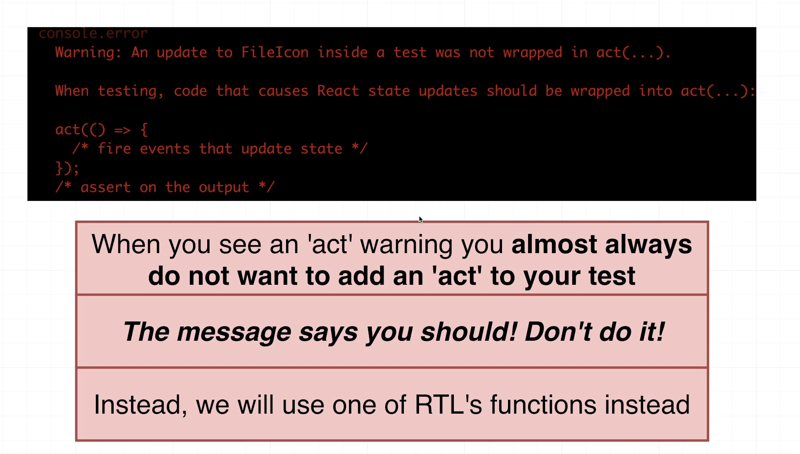

# Testing React using React Testing Library and Jest

- 
- Sample test
```jsx
import { render, screen, waitFor } from '@testing-library/react';

import user from '@testing-library/user-event';
import App from './App';

test('shows 6 products by default', async () => {
  render(<App />);

  const titles = await screen.findAllByRole('heading');
  expect(titles).toHaveLength(6);
});

test('clicking on the button loads 6 more products', async () => {
  render(<App />);

  const button = await screen.findByRole('button', {
    name: /load more/i,
  });

  user.click(button);

  await waitFor(async () => {
    const titles = await screen.findAllByRole('heading');
    expect(titles).toHaveLength(12);
  });
});

//});

```
- We can run these tests by running the following command:
```shell
yarn test 
```
- 
- 
- 

### Understanding how testing code works
- 
- 
- 

## Overview of the Testing Process
- 
- 

### Creating a new React Project
- 
- Creating the UserForm component
```jsx
import React, {useState} from 'react'


function UserForm() {
    const [email,setEmail] = useState('');
    const [name,setName] = useState('');
    const handleSubmit = (e) => {
        e.preventDefault();
        console.log(name,email);
    }

    return (
        <form onSubmit={handleSubmit}>
            <div>
                <label>Name</label>
                <input value={name} onChange={(e) => setName(e.target.value)} />
            </div>
            <div>
                <label>Email</label>
                <input value={email} onChange={(e) => setEmail(e.target.value)} />
            </div>
            <button>Add User</button>
        </form>
    )
}

export default UserForm

```
- We can write our UserList component as follows:
```jsx
import React from 'react'

function UserList({users}) {
    const renderedUsers = users.map((user) => {
        return (
            <tr key={user.name}>
                <td>{user.name}</td>
                <td>{user.email}</td>
            </tr>
        )
    })

    return (
    <>
        {users && users.length > 0 ?
            <table className="table table-striped">
                <thead>
                <tr>
                    <th>Name</th>
                    <th>Email</th>
                </tr>
                </thead>
                <tbody>
                {renderedUsers}
                </tbody>
            </table>  : <p>No users found!</p>}

    </>
)
}

export default UserList

```
- Code for App.js will be as follows:
```jsx
import UserForm from "./UserForm";
import {useState} from "react";
import UserList from "./UserList";


function App() {
  const [users,setUsers] = useState([]);
  const onUserAdd = (user) => {
    setUsers([...users, user]);
  }

  return <div>
  <UserForm onUserAdd={onUserAdd}/>
    <hr/>
    <UserList users = {users}/>
  </div>
}

export default App;

```
## Writing the first test for the above code
- 
- 
- 
- We can write our first UserForm.test.js as follows:
```jsx
import {render,screen} from '@testing-library/react';
import user from '@testing-library/user-event'
import UserForm from './UserForm';

test('it shows 2 inputs and a button', () => {
    //Render the component
    render(<UserForm />);

    //Manipulate the component or find an element inside of it
    const inputs = screen.getAllByRole('textbox');
    const button = screen.getByRole('button');

    //Assertion-make sure the component is doing what is expected
    expect(inputs.length).toBe(2);
    expect(button).toBeInTheDocument();

})
```
- When we run our tests, they are executed in NodeJS environment
- jsDom creates a fake browser environment whenever we call render() method
- 
- We can then access elements using screen object
- We can use query methods like getAllByRole() and getByRole() to access the elements
- 
- 

### Understanding ARIA roles
- Note that we have code like this:
```jsx
 //Manipulate the component or find an element inside of it
    const inputs = screen.getAllByRole('textbox');
    const button = screen.getByRole('button');
```
- These roles are called ARIA roles
- ARIA roles clarify the purpose of an HTML element
- They were traditionally used by screen-readers-softwares that help people understand content on the screen
- Many HTML elements have an "implicit" or automatically assigned role.
- Elements can be assigned manually a role also. 
- 

### Understanding JEST matchers
- We have the following code:
```jsx
//Assertion-make sure the component is doing what is expected
    expect(inputs.length).toBe(2);
    expect(button).toBeInTheDocument();
```
- expect is provided by JEST testing framework
- It has JEST matchers like toHaveLength() or toBeInDocument()
- 
- 
- 


### Simulating User Events
- 
- One not so good implementation is as follows:
```jsx
test('it calls onUserAdd when the form is submitted', async () => {
    //NOT THE BEST IMPLEMENTATION
    const argList=[];
    const callback = (...args) =>{
        argList.push(args);
    }
    //Render the component
    render(<UserForm onUserAdd={callback} />);

    //Find the 2 inputs
    const [nameInput,emailInput] = screen.getAllByRole('textbox');

    //Simulate typing in a name and email
    user.click(nameInput);
    user.keyboard('jane');

    user.click(emailInput);
    user.keyboard('jane@jane.com');

    //Find the button
    const button = screen.getByRole('button');

    //Simulate clicking the button
    user.click(button);

    //Assertion to make sure 'onUserAdd' gets called with name and email
    //expect(callback).toBeCalledWith({name,emailInput});
    expect(argList).toHaveLength(1);
    expect(argList[0][0]).toEqual({name:'jane',email:'jane@jane.com'});

})
```

### Introducing Mock Functions
- 
- 
- 
- Jest has a mock function: jest.fn()
```jsx
test('it calls onUserAdd when the form is submitted', async () => {
    //NOT THE BEST IMPLEMENTATION
    // const argList=[];
    // const callback = (...args) =>{
    //     argList.push(args);
    // }

    //BETTER IMPLEMENTATION
    const mock = jest.fn();


    //Render the component
    render(<UserForm onUserAdd={mock} />);

    //Find the 2 inputs
    const [nameInput,emailInput] = screen.getAllByRole('textbox');

    //Simulate typing in a name and email
    user.click(nameInput);
    user.keyboard('jane');

    user.click(emailInput);
    user.keyboard('jane@jane.com');

    //Find the button
    const button = screen.getByRole('button');

    //Simulate clicking the button
    user.click(button);

    //Assertion to make sure 'onUserAdd' gets called with name and email
    //expect(callback).toBeCalledWith({name,emailInput});
    //expect(argList).toHaveLength(1);
    //expect(argList[0][0]).toEqual({name:'jane',email:'jane@jane.com'});

    expect(mock).toHaveBeenCalledTimes(1);
    expect(mock).toHaveBeenCalledWith({name:'jane',email:'jane@jane.com'})
})
```
### Querying Elements by Labels
- 
- 
- We can reorder inputs, add more inputs without breaking the test
```jsx
test('it calls onUserAdd when the form is submitted', async () => {
    //NOT THE BEST IMPLEMENTATION
    // const argList=[];
    // const callback = (...args) =>{
    //     argList.push(args);
    // }

    //BETTER IMPLEMENTATION
    const mock = jest.fn();


    //Render the component
    render(<UserForm onUserAdd={mock} />);

    //Find the 2 inputs
    //const [nameInput,emailInput] = screen.getAllByRole('textbox');
    const nameInput = screen.getByRole("textbox",{
        name: /name/i
    })
    const emailInput = screen.getByRole("textbox",{
        name: /email/i
    })

    //Simulate typing in a name and email
    user.click(nameInput);
    user.keyboard('jane');

    user.click(emailInput);
    user.keyboard('jane@jane.com');

    //Find the button
    const button = screen.getByRole('button');

    //Simulate clicking the button
    user.click(button);

    //Assertion to make sure 'onUserAdd' gets called with name and email
    //expect(callback).toBeCalledWith({name,emailInput});
    //expect(argList).toHaveLength(1);
    //expect(argList[0][0]).toEqual({name:'jane',email:'jane@jane.com'});

    expect(mock).toHaveBeenCalledTimes(1);
    expect(mock).toHaveBeenCalledWith({name:'jane',email:'jane@jane.com'})
})
```

### Testing the UserList
- 
- 
- We will use the testing playground to help us write query functions
- For this we need to add this code to our test
```jsx
screen.logTestingPlaygroundURL();
```
- 
- 
- 
- Please note if we use the query function, we will find all the rows including the rows in the header which we dont want
```jsx
    //Find all the rows in the table
    screen.logTestingPlaygroundURL();
    const rows = screen.getAllByRole('row');
```
- 
- We will go with Fallback #1
- Add a data-testid to the UserList.js component
```jsx
import React from 'react'

function UserList({users}) {
    const renderedUsers = users.map((user) => {
        return (
            <tr key={user.name}>
                <td>{user.name}</td>
                <td>{user.email}</td>
            </tr>
        )
    })

    return (
    <>
        {users && users.length > 0 ?
            <table className="table table-striped">
                <thead>
                <tr>
                    <th>Name</th>
                    <th>Email</th>
                </tr>
                </thead>
                <tbody data-testid="users">
                {renderedUsers}
                </tbody>
            </table>  : <p>No users found!</p>}

    </>
)
}

export default UserList

```
- Now we can modify our test as follows:
```jsx
test('render one row per user', ()=>{
//Render the component
    const users = [
        {
            name:'jane',
            email:'jane@example.com',
        },
        {
            name:'sam',
            email: 'sam@sam.com',
        }
    ]
    //Render the component
    render(<UserList users={users} />);

    //Find all the rows in the table
    //screen.logTestingPlaygroundURL();
    //const rows = screen.getAllByRole('row');
    const rows = within(screen.getByTestId('users')).getAllByRole('row');

    //Assertion: correct number of rows in the table
    expect(rows).toHaveLength(2);
});
```
- However, for testing purposes, we are modifying our component, this is not the best idea

### Another Query Function Fallback
- We can also use the container approach and get the elements directly
```jsx
test('render one row per user', ()=>{
//Render the component
    const users = [
        {
            name:'jane',
            email:'jane@example.com',
        },
        {
            name:'sam',
            email: 'sam@sam.com',
        }
    ]
    //Render the component
    //Automatically added HTML property when we render the component
    const {container} =  render(<UserList users={users} />);

    //Find all the rows in the table
    //screen.logTestingPlaygroundURL();
    //const rows = screen.getAllByRole('row');
    //const rows = within(screen.getByTestId('users')).getAllByRole('row');
    const table = container.querySelector('table');
    const rows = container.querySelectorAll('tbody tr');


    //Assertion: correct number of rows in the table
    expect(rows).toHaveLength(2);
});
```
### Testing the contents of a Table
```jsx
test('render the email and name for each user', ()=>{
    //Render the component
    const users = [
        {
            name:'jane',
            email:'jane@example.com',
        },
        {
            name:'sam',
            email: 'sam@sam.com',
        }
    ]
    //Render the component
    render(<UserList users={users} />);

    screen.logTestingPlaygroundURL();

    for(let user of users){
        const name  = screen.getByRole('cell', { name: user.name });
        const email = screen.getByRole('cell', { name: user.email });
        expect(name).toBeInTheDocument();
        expect(email).toBeInTheDocument();
    }
})
```
### Avoiding duplication in the test file
- To do some initial setup, before running the tests we can use the beforeEach(()=>{}) function
- This function will run some code before executing the tests in the test file
- So we can put some common logic in there
- There is an alternative approach also, we can use a common function and call that function inside our components like this

```jsx
import {render,screen, within} from '@testing-library/react';
import UserList from './UserList';

function renderComponent(){
    const users = [
        {
            name:'jane',
            email:'jane@example.com',
        },
        {
            name:'sam',
            email: 'sam@sam.com',
        }
    ]

    render(<UserList users={users} />)

    return {
        users,
    }
}

test('render one row per user', ()=>{
//Render the component
    renderComponent();

    //Find all the rows in the table
    //screen.logTestingPlaygroundURL();
    //const rows = screen.getAllByRole('row');
    const rows = within(screen.getByTestId('users')).getAllByRole('row');
    //const table = container.querySelector('table');
    //const rows = container.querySelectorAll('tbody tr');


    //Assertion: correct number of rows in the table
    expect(rows).toHaveLength(2);
});

test('render the email and name for each user', ()=>{
    //Render the component
    const {users} = renderComponent();

    screen.logTestingPlaygroundURL();

    for(let user of users){
        const name  = screen.getByRole('cell', { name: user.name });
        const email = screen.getByRole('cell', { name: user.email });
        expect(name).toBeInTheDocument();
        expect(email).toBeInTheDocument();
    }
})
```
### Testing the App Component
- To get an idea of what the component is rendering on screen, after performing various actions, we can use the following code:
```jsx
screen.debug()
```
- We can test the whole App.test.js as follows:
```jsx
import { render, screen } from '@testing-library/react';
import App from './App';
import user from '@testing-library/user-event'


test('renders without crashing', () => {
  render(<App />);
});

test('can receive a new user and show it on a list',()=>{
  render(<App />);
  const nameInput = screen.getByRole("textbox",{
    name: /name/i
  });

  const emailInput = screen.getByRole("textbox",{
    name: /email/i
  });

  const button = screen.getByRole('button');

  user.click(nameInput);
  user.keyboard('jane');
  user.click(emailInput);
  user.keyboard('jane@jane.com');

  user.click(button);

  //Getting feedback for how the component is rendering
  //screen.debug();

  const name = screen.getByRole('cell', { name: /^jane$/i });  // Exact match with regex
  const email = screen.getByRole('cell', { name: /jane@jane\.com/i });  // Email-specific pattern

  expect(name).toBeInTheDocument();
  expect(email).toBeInTheDocument();

})
```
### Using Test Driven Development(TDD)
- Make a test which fails.
- We basically need to reset the form inputs when the form is submitted
- This test will fail initially
```jsx
test('empties the two inputs when the form is submitted',()=>{
    render(<UserForm onUserAdd={()=>{}} />);

    const nameInput = screen.getByRole("textbox",{name: /name/i})
    const emailInput = screen.getByRole("textbox",{name: /email/i})
    const button = screen.getByRole('button');

    user.click(nameInput);
    user.keyboard('jane');
    user.click(emailInput);
    user.keyboard('jane@jane.com');
    user.click(button);

    expect(nameInput).toHaveValue('');
    expect(emailInput).toHaveValue('')

})
```
- Now we will make code changes in our component in the handleSubmit() function
```jsx
function UserForm({onUserAdd}) {
    const [email,setEmail] = useState('');
    const [name,setName] = useState('');
    const handleSubmit = (e) => {
        e.preventDefault();
        //console.log(name,email);
        onUserAdd({name,email})
        setEmail('');
        setName('');
    }
```

- Now our test starts passing

## Understanding Element Roles

### RTL Book
- 
- 

### Partial Role List(Finding by Role Name)
- Consider we have the following component:
```jsx
import {render,screen} from '@testing-library/react';

function RoleExample(){
  return (
    <div>
    <a href = "/">Link</a>
    <button>Button</button>
    <footer>Content Info</footer>
    <h1>Heading</h1>
    <header>Banner</header>
     Img
    <input type="checkbox"/> checkbox
    <input type="number" /> Spinbutton
    <input type="radio" /> radio
    <input type = "text" /> Textbox
    <li>List Item</li>
    <ul>Listgroup</ul>
    </div>
  )
}

render(<RoleExample/>)
```

- Now if we have to write a test to select each of the element we can do it like this
```jsx
test('can find elements by role',()=>{
  render(<RoleExample/>)
  const roles = [
    'link',
    'button',
    'contentinfo',
    'heading',
    'banner',
    'img',
    'checkbox',
    'spinbutton',
    'radio',
    'textbox',
    'listitem',
    'list'
  ];

  for(let role of roles)
  {
    const el = screen.getByRole(role);
    expect(el).toBeInTheDocument();
  }
})
```

### Finding by Accessible Names
- The accessible name of an element is the text inside of it
- However, input element doesnot have a text inside of it
- It can be useful for buttons
- We have the following component:
```jsx
function AccessibleName(){
  return (
    <div>
    <button>Submit</button>
    <button>Cancel</button>
    </div>
  )
}

render(<AccessibleName/>)
```
- Its test cases can be as follows:
```jsx
test('can select by accessible name',()=>{
  render(<AccessibleName/>)
  const submitBtn = screen.getByRole('button',{
    name: /Submit/i
  })
  const cancelBtn = screen.getByRole('button',{
    name: /Cancel/i
  })
expect(submitBtn).toBeInTheDocument()
expect(cancelBtn).toBeInTheDocument()
})
```

### Linking Inputs to Labels
- Suppose we have a component like this
```jsx
function MoreNames(){
  return (
    <div>
    <label htmlFor="email">Email</label>
    <input id="email" />

    <label htmlFor="search">Search</label>
    <input id="search"/>
    </div>
  )
}
```
- Now we can test it as follows:
```jsx
test('make sure 2 inputs rendered',()=>{
  render(<MoreNames/>);
  const emailInput = screen.getByRole('textbox',{
    name:/email/i
  });

  const searchInput = screen.getByRole('textbox',{
    name:/search/i
  });

  expect(emailInput).toBeInTheDocument();
  expect(searchInput).toBeInTheDocument();

})
```
### Directly Assigning an Accessible Name
- If we don't want to assign a name to the element, we can make use of aria-labels
- Consider the following JSX:
```jsx
function IconButtons(){
  return (
    <div>
    <button aria-label="sign in">
    <svg />
    </button>

    <button aria-label="sign out">
    <svg />
    </button>
    </div>
  )
}

render(<IconButtons/>)
```
- We can test it as follows:
```jsx
test('find elements based on label',()=>{

  render(<IconButtons/>)
  const signInButton = screen.getByRole('button',{
    name: /sign in/i
  });

  const signOutButton = screen.getByRole('button',{
    name: /sign out/i
  });

expect(signInButton).toBeInTheDocument();
  expect(signOutButton).toBeInTheDocument();


})
```

## Finding elements by Query Functions
- 
- 
- So they are getBy, getAllBy, queryBy, queryAllBy, findBy, findAllBy
- 
- 
- 
- Lets say we have this component:
```jsx


function ColorList(){
  return (
    <ul> 
    <li>Red</li>
    <li>Blue</li>
    <li>Green</li>
    </ul>
  );
}

render(<ColorList/>);
```
- We can test it by using query functions as follows:
```jsx
test('getBy, queryBy, findBy finding 0 elements',async ()=>{

  render(<ColorList/>)
  //getByRole, getByText
  //screen.getByRole('textbox') //shows error


  //queryByRole, queryByText
  screen.queryByRole('textbox') //returns null

  //findByRole
  //Works asynchronously
  //Watch the output of the component over a span of one second by default and many times within that second by default(every 50 milliseconds)
  //Will try to find that element else will throw an error
  //Technically it returns a promise that gets rejected
  
  let errorThrown = false;
  try {
  await screen.findByRole('textbox') //shows error after 1 second
  }
  catch(err){
    errorThrown = true;
  }

  expect(errorThrown).toEqual(true)
  


  //This is a matcher
  expect(
    ()=> screen.getByRole('textbox')
    ).toThrow();

     expect(
    screen.queryByRole('textbox')
    ).toEqual(null);

    

})
```

- What if these query functions find exactly one element
```jsx
test('getBy, queryBy, findBy when they find 1 element',async ()=>{
render(<ColorList/>)

expect(screen.getByRole('list')).toBeInTheDocument();

expect(screen.queryByRole('list')).toBeInTheDocument();

expect(await screen.findByRole('list')).toBeInTheDocument();

})
```
- What if these query functions find more than one element
```jsx
test('getBy, queryBy, findBy when they find greater than 1 element',async ()=>{
render(<ColorList/>)

 expect(()=>
screen.getByRole('listitem') 
 ).toThrow();
   
 expect(
()=> screen.queryByRole('listitem') 
 ).toThrow();
  
  
  let errorThrown = false;
  try {
  await screen.findByRole('listitem') //shows error after 1 second
  }
  catch(err){
    errorThrown = true;
  }

  expect(errorThrown).toEqual(true)
})
```

### Multiple Element Variations
- Lets try with getAllBy, queryAllBy and findAllBy variations
```jsx
test('getAllBy, queryAllBy, findAllBy', async ()=>{

render(<ColorList/>)

expect(screen.getAllByRole('listitem')
).toHaveLength(3)

expect(screen.queryAllByRole('listitem')
).toHaveLength(3)

expect(await screen.findAllByRole('listitem')
).toHaveLength(3)

})

```
- If we want to write a test to check if a textbox exists or not, then the following test will fail and show error
```jsx
test('favor using getBy to prove an element exists',()=>{
  render(<ColorList/>)

  const element = screen.getByRole('textbox');

  expect(element).toBeInTheDocument()
})
```
- However, the following test will pass
```jsx
test('favor using queryBy to prove an element doesnot exist',()=>{
  render(<ColorList/>)

  const element = screen.queryByRole('textbox');

  expect(element).not.toBeInTheDocument()
})
```

### When to use Async Queries
- This is useful in case of Data-fetching from the server 
- We will make a fake network request and wait for some elements to eventually appear on screen
- Refer to this component
```jsx
//import {useState,useEffect} from 'react'

function fakeFetchColors(){
  return Promise.resolve(
    ['red','green','blue']
  );
}

function LoadableColorList(){
  const [colors,setColors] = useState([]);

useEffect(()=>{
fakeFetchColors()
.then(c => setColors(c))
},[])

const renderedColors = colors.map(color => {

  return <li key = {color}>{color}</li>
})

return <ul>{renderedColors}</ul>

}

render(<LoadableColorList/>)
```
- We can write the following test which will fail since we are returning a promise and try to check if it rendered the list items instantly
- This is not correct, as there is a fraction of a second before a promise resolves
```jsx
test('Favor findBy or findAllBy when data fetching',async ()=>{

  render(<LoadableColorList/>)
  const els = screen.getAllByRole('listitem');

  expect(els).toHaveLength(3)
})
```
- In this case we need to use findBy method like this
```jsx
test('Favor findBy or findAllBy when data fetching',async ()=>{

  render(<LoadableColorList/>)
  const els = await screen.findAllByRole('listitem');

  expect(els).toHaveLength(3)
})
```

## Query Function Suffixes
- 
- 
- Lets say we have a component like this
```jsx
function DataForm(){
  const [email,setEmail] = useState('fgh@fgh.com');

  return (
    <form>
    <h3>Enter Data</h3>
    <div data-testid="image wrapper">
    
    </div>

    <label htmlFor="email">Email</label>
    <input
    id="email"
    value={email}
    onChange={e=>setEmail(e.target.value)}
    />

    <label htmlFor="color">Color</label>
    <input
    id="color"
   placeholder="Red"
    />

<button title="Click when ready to submit">Submit</button>

    </form>
  )
}

render(<DataForm/>)
```
- We can write a test for it as follows:
```jsx
test('selecting different elements',()=>{
  render(<DataForm/>)

  const elements = [
      
  ];

  for(let elem in elements){
    expect(elem).toBeInTheDocument();
  }
})
```
- 
- We can write various query functions like this
```jsx
test('selecting different elements',()=>{
  render(<DataForm/>)

  const elements = [
      screen.getByRole('button'),
      screen.getByLabelText('Email'),
      screen.getByPlaceholderText('Red'),
      screen.getByText('Enter Data'),
      screen.getByDisplayValue('fgh@fgh.com'),
      screen.getByAltText('data'),
      screen.getByTitle('Click when ready to submit'),
      screen.getByTestId('image wrapper')
  ];

  for(let elem of elements){
    expect(elem).toBeInTheDocument();
  }
})
```

## Matchers in Jest
- 
- Say you have a list of elements inside a JSX
- you only want to query elements only within a specific element
- For e.g look for list of buttons inside a form element
- Consider the component:
```jsx
function FormData() {
  return (
    <div>
    <button>Go Back</button>
    <form aria-label="form">
    <button>Save</button>
    <button>Cancel</button>
    </form>
    </div>
  )
}

render(<FormData/>)
```
- We can write a test as follows:
- However, it will fail since it will find 3 buttons instead of 2
```jsx
test('the form displays 2 buttons',()=>{
  render(<FormData/>)
    
  const buttons = screen.getAllByRole('button');

  expect(buttons).toHaveLength(2);
})
```
- Therefore, we need to use "within" keyword to find buttons only within a form
```jsx
test('the form displays 2 buttons',()=>{
  render(<FormData/>)

  const form = screen.getByRole('form');
  const buttons = within(form).getAllByRole('button');

  expect(buttons).toHaveLength(2);
})
```
- Even this approach can get messy really quickly if we have a form with lot of elements
- Therefore, we need a custom matcher
- We need to do something like this
```jsx
test('the form displays 2 buttons',()=>{
  render(<FormData/>)

  const form = screen.getByRole('form');
  //const buttons = within(form).getAllByRole('button');

  //expect(buttons).toHaveLength(2);
  expect(form).toContainRole('button',2)
})
```

### More on Custom Jest Matchers
- We can write a custom Jest Matcher as follows:
```jsx
function toContainRole(container,role,quantity = 1) {
    //query to find elements with the specified role inside the container
      const elements = within(container).queryAllByRole(role);
      
    //return the object
    if(elements.length === quantity)
      {
        return {
          pass:true
        };
      }

    //return {
      //pass:true -->everything is good, test passes
    //}

    //if the test fails, then pass a message also why it failed
    return {
      pass: false,
      message: () => `Expected to find ${quantity} ${role} elements. Found ${elements.length} instead`
    }
}

//Register the custom matcher with expect
expect.extend({toContainRole})
```
- We can use it as follows:
```jsx
test('the form displays 2 buttons',()=>{
  render(<FormData/>)

  const form = screen.getByRole('form');
  //const buttons = within(form).getAllByRole('button');

  //expect(buttons).toHaveLength(2);
  expect(form).toContainRole('link',10)
})
```
- The above test fails, as it didnot find a link role inside form with 10 quantity
- 

## Big Project Overview
- 
- 
- 
- A sample bug report
- 
- 
- Lets say we have this component:
```jsx
import { StarIcon } from '@primer/octicons-react';

function RepositoriesSummary({ repository }) {
  const { stargazers_count, open_issues, forks } = repository;

  return (
    <div className="flex flex-row gap-4 text-gray-700">
      <div>
        <StarIcon aria-label="stars" size={16} /> {stargazers_count}
      </div>
      <div>{open_issues} issues need help</div>
      <div>{forks} Forks</div>
    </div>
  );
}

export default RepositoriesSummary;

```
- 
- We can write a test for this as follows:
```jsx
import {screen, render } from '@testing-library/react';
import RepositoriesSummary from './RepositoriesSummary';

test('displays the primary language of the repository',()=>{
    const repository = {
        language: 'javascript',
        stargazers_count: 1,
        forks: 30,
        open_issues: 20,
    }
    render(<RepositoriesSummary repository={repository} />);

    const language = screen.getByText('javascript');
    expect(language).toBeInTheDocument();
})
```
- Initially this test will fail as language is not yet visible on the screen

### Looping over assertions
- Rather than finding each element individually, we can loop over them and assert them as well
- We can make use of Regular expressions to find partial matches
```jsx
import {screen, render } from '@testing-library/react';
import RepositoriesSummary from './RepositoriesSummary';

test('displays the primary language of the repository',()=>{
    const repository = {
        language: 'javascript',
        stargazers_count: 1,
        forks: 30,
        open_issues: 20,
    }
    render(<RepositoriesSummary repository={repository} />);

    const language = screen.getByText('javascript');
    expect(language).toBeInTheDocument();
})

test('displays the information about the repository',()=>{
    const repository = {
        language: 'javascript',
        stargazers_count: 7,
        forks: 30,
        open_issues: 20,
    }
    render(<RepositoriesSummary repository={repository} />);

    // const language = screen.getByText('javascript');
    // const stars = screen.getByText(7);
    //
    // expect(language).toBeInTheDocument();
    // expect(stars).toBeInTheDocument();

    for(let key in repository) {
        const value = repository[key];

        const element = screen.getByText(new RegExp(value));
        expect(element).toBeInTheDocument();
    }
})
```

## Using the ACT function
- Another bug
- 
- 
- 
- Note that when we render a parent item inside a test method, we also render its children
- We also need to create React Router context
- Sometimes those children might be rendered by outside libraries
- They may try to reach out to external code to render
- 
- 
- Our RepositoriesListItem component is like this:
```jsx
import { Link } from 'react-router-dom';
import FileIcon from '../tree/FileIcon';
import RepositoriesSummary from './RepositoriesSummary';

function RepositoriesListItem({ repository }) {
  const { full_name, language, description, owner, name } = repository;

  return (
    <div className="py-3 border-b flex">
      <FileIcon name={language} className="shrink w-6 pt-1" />
      <div>
        <Link to={`/repositories/${full_name}`} className="text-xl">
          {owner.login}/<span className="font-bold">{name}</span>
        </Link>
        <p className="text-gray-500 italic py-1">{description}</p>
        <RepositoriesSummary repository={repository} />
      </div>
    </div>
  );
}

export default RepositoriesListItem;

```
- We can plan to test this using Memory Router like this
```jsx
import {render,screen} from '@testing-library/react';
import RepositoriesListItem from './RepositoriesListItem';
import {MemoryRouter} from 'react-router-dom';

function renderComponent(){
    const repository = {
        language: 'javascript',
        full_name: 'facebook/react',
        owner: 'facebook',
        name:'react',
        description:'A JS library',
        html_url: 'https://github.com/facebook/react',
    }
    render(
        <MemoryRouter>
        <RepositoriesListItem repository={repository}/>
        </MemoryRouter>
        );
}

test('shows a link to the github homepage for this repository',()=>{
   renderComponent();
})

```

### 'act' Warnings
- 
- 
- 
- A sample test would look like this
- 
- What would happen behind the scenes?
- 

### Act function defines a window in time where state updates can(or should) occur
- 
- 
- These functions are asynchronous
- 
- 

### Solving Act Warnings
- 
- If we have an async function that returns a promise inside a useEffect() function, we will probably see an 'act' warning
- We can write tests as follows:
```jsx
import {render,screen} from '@testing-library/react';
import RepositoriesListItem from './RepositoriesListItem';
import {MemoryRouter} from 'react-router-dom';

function renderComponent(){
    const repository = {
        language: 'javascript',
        full_name: 'facebook/react',
        owner: 'facebook',
        name:'react',
        description:'A JS library',
        html_url: 'https://github.com/facebook/react',
    }
    render(
        <MemoryRouter>
        <RepositoriesListItem repository={repository}/>
        </MemoryRouter>
        );
}

test('shows a link to the github homepage for this repository',async ()=>{
   renderComponent();
   await screen.findByRole('img',{name:'javascript'});
})


//Add a small pause inside the test
const pause = () =>{
    return new Promise(resolve => setTimeout(resolve, 100));
}

```
### Module Mocks to avoid rendering the troublesome component
- We can also skip child components while testing parent components using module mocks
- We can use this kind of code to mock a component:
```jsx
jest.mock('../tree/FileIcon',()=>{
    //Content of FileIcon.js
    return ()=>{
        return 'File Icon component';
    }
})
```

### Using the "act" function(last ditch solution)
```jsx
import {render,screen, act} from '@testing-library/react';
import RepositoriesListItem from './RepositoriesListItem';
import {MemoryRouter} from 'react-router-dom';


// jest.mock('../tree/FileIcon',()=>{
//     //Content of FileIcon.js
//     return ()=>{
//         return 'File Icon component';
//     }
// })

function renderComponent(){
    const repository = {
        language: 'javascript',
        full_name: 'facebook/react',
        owner: 'facebook',
        name:'react',
        description:'A JS library',
        html_url: 'https://github.com/facebook/react',
    }
    render(
        <MemoryRouter>
        <RepositoriesListItem repository={repository}/>
        </MemoryRouter>
        );
}

test('shows a link to the github homepage for this repository',async ()=>{
   renderComponent();
   // await screen.findByRole('img',{name:'javascript'});
    //screen.debug();
    
    await act(async() => {
        await pause();
    });
})


//Add a small pause inside the test
const pause = () =>{
    return new Promise(resolve => setTimeout(resolve, 100));
}

```

### Fixing the bug
- Inside the RepositoriesListItem.js we will add the following code:
```jsx
import { Link } from 'react-router-dom';
import {MarkGithubIcon} from "@primer/octicons-react";
import FileIcon from '../tree/FileIcon';
import RepositoriesSummary from './RepositoriesSummary';

function RepositoriesListItem({ repository }) {
  const { full_name, language, description, owner, name } = repository;

  return (
    <div className="py-3 border-b flex">
      <FileIcon name={language} className="shrink w-6 pt-1" />
      <div>
        <Link to={`/repositories/${full_name}`} className="text-xl">
          {owner.login}/<span className="font-bold">{name}</span>
        </Link>
        <p className="text-gray-500 italic py-1">{description}</p>
        <RepositoriesSummary repository={repository} />
      </div>
        <div className="grow flex items-center justify-end pr-2">
            <a href={repository.html_url} aria-label="github repository">
                <MarkGithubIcon />
            </a>
        </div>
    </div>
  );
}

export default RepositoriesListItem;

```
- Now we will update our test as follows:
```jsx
import {render,screen, act} from '@testing-library/react';
import RepositoriesListItem from './RepositoriesListItem';
import {MemoryRouter} from 'react-router-dom';


// jest.mock('../tree/FileIcon',()=>{
//     //Content of FileIcon.js
//     return ()=>{
//         return 'File Icon component';
//     }
// })

function renderComponent(){
    const repository = {
        language: 'javascript',
        full_name: 'facebook/react',
        owner: 'facebook',
        name:'react',
        description:'A JS library',
        html_url: 'https://github.com/facebook/react',
    }
    render(
        <MemoryRouter>
        <RepositoriesListItem repository={repository}/>
        </MemoryRouter>
        );

    return {repository};
}

test('shows a link to the github homepage for this repository',async ()=>{
   const {repository} = renderComponent();

   await screen.findByRole('img',{name:'javascript'});
   const link =  screen.getByRole('link',{
       name: /github repository/i
   });
   expect(link).toHaveAttribute('href',repository.html_url)
})


//Add a small pause inside the test
const pause = () =>{
    return new Promise(resolve => setTimeout(resolve, 100));
}

```
### Checking the icon
- We can write another test to check the file icon as follows
- Notice we are checking if our icon has the class: js-icon
```jsx
import {render,screen, act} from '@testing-library/react';
import RepositoriesListItem from './RepositoriesListItem';
import {MemoryRouter} from 'react-router-dom';


// jest.mock('../tree/FileIcon',()=>{
//     //Content of FileIcon.js
//     return ()=>{
//         return 'File Icon component';
//     }
// })

function renderComponent(){
    const repository = {
        language: 'javascript',
        full_name: 'facebook/react',
        owner: 'facebook',
        name:'react',
        description:'A JS library',
        html_url: 'https://github.com/facebook/react',
    }
    render(
        <MemoryRouter>
        <RepositoriesListItem repository={repository}/>
        </MemoryRouter>
        );

    return {repository};
}

test('shows a link to the github homepage for this repository',async ()=>{
   const {repository} = renderComponent();

   await screen.findByRole('img',{name:'javascript'});
   const link =  screen.getByRole('link',{
       name: /github repository/i
   });
   expect(link).toHaveAttribute('href',repository.html_url)
})

test('shows a file icon with the appropriate icon',async ()=>{
    renderComponent();

    const icon = await screen.findByRole('img',{name:'Javascript'});
    expect(icon).toHaveClass('js-icon')
})

//Add a small pause inside the test
const pause = () =>{
    return new Promise(resolve => setTimeout(resolve, 100));
}

```

### Checking the Link
- We can write a test to check a link to the code editor as follows:
```jsx
import {render,screen, act} from '@testing-library/react';
import RepositoriesListItem from './RepositoriesListItem';
import {MemoryRouter} from 'react-router-dom';


// jest.mock('../tree/FileIcon',()=>{
//     //Content of FileIcon.js
//     return ()=>{
//         return 'File Icon component';
//     }
// })

function renderComponent(){
    const repository = {
        language: 'javascript',
        full_name: 'facebook/react',
        owner: {
            login:'facebook'
        },
        name:'react',
        description:'A JS library',
        html_url: 'https://github.com/facebook/react',
    }
    render(
        <MemoryRouter>
        <RepositoriesListItem repository={repository}/>
        </MemoryRouter>
        );

    return {repository};
}

test('shows a link to the github homepage for this repository',async ()=>{
   const {repository} = renderComponent();

   await screen.findByRole('img',{name:'javascript'});
   const link =  screen.getByRole('link',{
       name: /github repository/i
   });
   expect(link).toHaveAttribute('href',repository.html_url)
})

test('shows a file icon with the appropriate icon',async ()=>{
    renderComponent();

    const icon = await screen.findByRole('img',{name:'javascript'});
    expect(icon).toHaveClass('js-icon')
})

test('shows a link to the code editor page',async ()=>{
    const {repository} = renderComponent();

     const link  = await screen.findByRole('link',{name: new RegExp(repository.owner.login)});
     expect(link).toHaveAttribute('href',`/repositories/${repository.full_name}`);
})

//Add a small pause inside the test
const pause = () =>{
    return new Promise(resolve => setTimeout(resolve, 100));
}

```
## Handling Data Fetching in Tests
- Another Bug Report
- 
- We can fix it as follows:
```jsx
import Hero from '../components/Hero';
import RepositoriesTable from '../components/repositories/RepositoriesTable';
import useRepositories from '../hooks/useRepositories';

function HomeRoute() {
  const { data: jsRepos } = useRepositories('stars:>10000 language:javascript');
  const { data: tsRepos } = useRepositories('stars:>10000 language:typescript');
  const { data: rustRepos } = useRepositories('stars:>10000 language:rust');
  const { data: goRepos } = useRepositories('stars:>10000 language:go');
  const { data: pythonRepos } = useRepositories('stars:>10000 language:python');
  const { data: javaRepos } = useRepositories('stars:>10000 language:java');

  return (
    <div>
      <Hero />
      <div className="container mx-auto py-8 grid grid-cols-1 gap-4 md:grid-cols-2">
        <RepositoriesTable
          label="Most Popular Javascript"
          repositories={jsRepos}
        />
        <RepositoriesTable
          label="Most Popular Typescript"
          repositories={tsRepos}
        />
        <RepositoriesTable label="Most Popular Rust" repositories={rustRepos} />
        <RepositoriesTable label="Most Popular Go" repositories={goRepos} />
        <RepositoriesTable label="Most Popular Python" repositories={pythonRepos} />
        <RepositoriesTable label="Most Popular Java" repositories={javaRepos} />
      </div>
    </div>
  );
}

export default HomeRoute;

```
- Bug is fixed but that is not the objective
- How do we test this?
- 
- 
- 
- 

### Using a library to mock axios/fetch
- We will make use of Mock Service Workers
- The Mock service worker intercepts the axios or fetch request and rather than the request going to the server API, is handled by the Mock Service Worker
- 

### Setting up Mock Service Worker
- 
- We can create a mock service worker like this:
```jsx
import {render,screen} from '@testing-library/react';
import {setupServer} from "msw/node";
import {rest} from 'msw';
import {MemoryRouter} from "react-router-dom";
import HomeRoute from './HomeRoute';

//Intercept the API request
const handlers = [
    rest.get('/api/repositories',(req,res,ctx)=>{
        //get the querystring from the request
        const query = req.url.searchParams.get('q');
        console.log(query);
        //Simulate the response
        return res(
            ctx.json({
                items: [
                    {
                        id: 1,
                        full_name:'full name 1'
                    },
                    {
                        id: 2,
                        full_name:'full name 2'
                    }
                ]
            })
        )
    })
]

const server = setupServer(...handlers);
//Run before all the tests
beforeAll(()=>{
    server.listen();
})
//Run after each test to do some cleanup
afterEach(()=>{
    server.resetHandlers();
})
//Run after all the tests have executed
afterAll(()=>{
    server.close();
})
```
- We can get started with an initial test as follows:
```jsx
test('renders 2 links for each language',async ()=>{
    render(
        <MemoryRouter>
            <HomeRoute/>
        </MemoryRouter>
    )

    screen.debug();

    //Loop over each language
    //For each language make sure we see 2 links
    //Assert that links have fullname
})
```
- We can complete the full test as follows:
```jsx
import {render,screen} from '@testing-library/react';
import {setupServer} from "msw/node";
import {rest} from 'msw';
import {MemoryRouter} from "react-router-dom";
import HomeRoute from './HomeRoute';
import {expect} from "playwright/test";

//Intercept the API request
const handlers = [
    rest.get('/api/repositories',(req,res,ctx)=>{
        //get the querystring from the request
        const query = req.url.searchParams.get('q');
        const language = query.split('language:')[1];
        //console.log(language)

        //console.log(query);
        //Simulate the response(mock data)
        return res(
            ctx.json({
                items: [
                    {
                        id: 1,
                        full_name:`${language}_one`
                    },
                    {
                        id: 2,
                        full_name:`${language}_two`
                    }
                ]
            })
        )
    })
]

const server = setupServer(...handlers);
//Run before all the tests
beforeAll(()=>{
    server.listen();
})
//Run after each test to do some cleanup
afterEach(()=>{
    server.resetHandlers();
})
//Run after all the tests have executed
afterAll(()=>{
    server.close();
})

test('renders 2 links for each language',async ()=>{
    render(
        <MemoryRouter>
            <HomeRoute/>
        </MemoryRouter>
        )

    // await pause();
    //  screen.debug();
    const languages = [
        'javascript',
        'typescript',
        'rust',
        'go',
        'python',
        'java'
    ]

    //Loop over each language

    for(let language of languages){
        //For each language make sure we see 2 links
        const links = await screen.findAllByRole('link', {
            name: new RegExp(`${language}_`),
        })

        expect(links).toHaveLength(2)
        //Assert that links have fullname
        expect(links[0]).toHaveTextContent(`${language}_one`)
        expect(links[1]).toHaveTextContent(`${language}_two`)
        //expect(links[0]).toHaveAttribute('href',`/repositories/${language}_one`)
        //expect(links[1]).toHaveAttribute('href',`/repositories/${language}_two`)
    }


})

const pause = () => new Promise(resolve => setTimeout(resolve, 1000))
```
### Issue with Fake Handlers
- Lot of blog posts define this pattern
- Make one file: handlers.js and use it across components
- 
- However, there is a downside
- 
- 

### Easier Fake Routes
- We want to create a reusable Create Server function that has a configuration object to define various routes like this
- Each test file can define its own routes
```jsx
//GOAL
//Create a configuration object
//Each test file can define its own routes
createServer([
    {
        path: '/api/repositories',
        method: 'GET',
        res: (req,res,ctx) =>{
            return {
                items:[{},{}]
            }
        }
    },
    {
        path: '/api/repositories',
        method: 'POST',
        res: (req,res,ctx) =>{
            return {
                items:[{},{},{}]
            }
        }
    }
]);

//
```

### A better setup for implementing fake routes
- First define a util file: server.js inside the test folder
- Include the following code:
- This code takes the handler config and sets up a fake server using msw (Mock Service Worker) for Node.js testing. 
- This code exports a createServer function that auto-maps handler config to msw REST handlers, then sets up the server with proper lifecycle hooks (beforeAll, afterEach, afterAll). 
- This pattern is very useful for API integration and component testing.
```jsx
//Setup a fake server

import {setupServer} from "msw/node";
import {rest} from "msw";

export function createServer(handlerConfig) {
    //Look at the method passed in like GET,POST,PUT,DELETE etc
    const handlers = handlerConfig.map((config)=>{
        return rest[config.method || 'get'](config.path,(req,res,ctx)=>{
            return res(
                ctx.json(
                    config.res(req,res,ctx)
                )
            );
        })
    });

    const server = setupServer(...handlers);
    beforeAll (()=>{
        server.listen();
    });

    afterEach(()=>{
        server.resetHandlers();
    })
    afterAll(()=>{
        server.close();
    })
}
```
- We can then setup tests like this
- This reduces too much of boilerplate being included in each file
```jsx
import {render,screen} from '@testing-library/react';
import {setupServer} from "msw/node";
import {rest} from 'msw';
import {MemoryRouter} from "react-router-dom";
import HomeRoute from './HomeRoute';
import {expect} from "playwright/test";
import {createServer} from "../test/server";

//GOAL
//Create a configuration object
//Each test file can define its own routes
createServer([
    {
        path: '/api/repositories',
        method: 'get',
        res: (req) =>{
            const query = req.url.searchParams.get('q');
            const language = query.split('language:')[1];
            return {
                items: [
                    {
                        id: 1,
                        full_name:`${language}_one`
                    },
                    {
                        id: 2,
                        full_name:`${language}_two`
                    }
                ]
            }
        }
    }
]);

//

test('renders 2 links for each language',async ()=>{
    render(
        <MemoryRouter>
            <HomeRoute/>
        </MemoryRouter>
        )

    // await pause();
    //  screen.debug();
    const languages = [
        'javascript',
        'typescript',
        'rust',
        'go',
        'python',
        'java'
    ]

    //Loop over each language

    for(let language of languages){
        //For each language make sure we see 2 links
        const links = await screen.findAllByRole('link', {
            name: new RegExp(`${language}_`),
        })

        expect(links).toHaveLength(2)
        //Assert that links have fullname
        expect(links[0]).toHaveTextContent(`${language}_one`)
        expect(links[1]).toHaveTextContent(`${language}_two`)
        //expect(links[0]).toHaveAttribute('href',`/repositories/${language}_one`)
        //expect(links[1]).toHaveAttribute('href',`/repositories/${language}_two`)
    }


})

const pause = () => new Promise(resolve => setTimeout(resolve, 1000))
```
### Advantages of this approach
- Test Isolation and Customization:
Each test file can define its own mock API endpoints and responses by passing custom handler configs to createServer. This ensures your tests are isolated from each other and respond exactly as needed for each scenario.

- Cleaner, DRY Test Setup:
Boilerplate code for server setup, teardown, and handler mapping is encapsulated in one place. This avoids repetitive setup in every test file and keeps tests focused on assertions.

- Consistency and Maintainability:
Centralizing the server configuration pattern means any updates or fixes to your test server logic (like lifecycle hooks or error handling) are made in a single spot, benefiting all tests.

- Realistic API Mocking:
By mapping API endpoint handlers to specified routes and methods, you closely simulate real HTTP requests and server behavior, leading to more robust frontend tests.

- Easy Extension:
The function can be easily extended to support new routes, methods, or even dynamic response strategies without altering individual tests.

- In short, this approach streamlines test writing, promotes code reuse, and makes your tests more reliable and maintainable.

## Tests around Authentication
- We need to test the authentication buttons: SignIn and SignUp
- If the user signs in, he is shown the signOut button
- We have the following Authbuttons component
```jsx
import { Link } from 'react-router-dom';
import useUser from '../../hooks/useUser';

function AuthButtons() {
  const { user, isLoading } = useUser();

  if (isLoading) {
    return null;
  } else if (user) {
    return (
      <Link
        className="block whitespace-nowrap rounded-md px-5 py-2.5 text-sm font-medium border"
        to="/signout"
      >
        Sign Out
      </Link>
    );
  } else {
    return (
      <>
        <Link
          className="block whitespace-nowrap rounded-md border border-teal-600 text-teal-600 px-5 py-2.5 text-sm font-medium"
          to="/signin"
        >
          Sign In
        </Link>
        <Link
          className="block whitespace-nowrap rounded-md bg-teal-600 border border-teal-600 px-5 py-2.5 text-sm font-medium text-white"
          to="/signup"
        >
          Sign Up
        </Link>
      </>
    );
  }
}

export default AuthButtons;

```
- 
- We need to setup tests like this:
```jsx
import {render, screen} from '@testing-library/react';
import {MemoryRouter} from 'react-router-dom';
import {createServer} from "../../test/server";
import useUser from '../../hooks/useUser'
import AuthButtons from './AuthButtons';

//createServer --->GET 'api/user' --> {user: null}

test('when user is not signed in, sign in and signup are visible',async()=>{

});

test('when user is not signed in, signout is not visible', async()=>{

})

//createServer --->GET 'api/user' --> {user: {id:3, email: 'ntaneja@live.com'}}

test('when user is signed in, signedin and signup is not visible', async()=>{

})

test('when user is signed in, signout is visible', async()=>{

})


```
- Would this work?
- 
- This would not work
- Lets understand why
- Examine this code:
```jsx
import {render, screen} from '@testing-library/react';
import {MemoryRouter} from 'react-router-dom';
import {createServer} from "../../test/server";
import useUser from '../../hooks/useUser'
import AuthButtons from './AuthButtons';

//createServer --->GET 'api/user' --> {user: null}
createServer([
    {path: 'api/user', rest: () =>{
        return {
            user: null
        }
        }}
])
test('when user is not signed in, sign in and signup are visible',async()=>{
    console.log('test 1')

});

test('when user is not signed in, signout is not visible', async()=>{
    console.log('test 2')
})

//createServer --->GET 'api/user' --> {user: {id:3, email: 'ntaneja@live.com'}}
createServer([
    {path: 'api/user', rest: () =>{
            return {
            user: {id:3, email: 'ntaneja@live.com'}
            }
        }}
])
test('when user is signed in, signedin and signup is not visible', async()=>{
    console.log('test 3')
})

test('when user is signed in, signout is visible', async()=>{
    console.log('test 4')
})


```
- We see logs like this
```shell
A server is listening
A server is listening
test 1
test 2
test 3
test 4
A server is closed
A server is closed

```
### Why Do I See Multiple Server Start Logs Before Tests Run?

When Jest loads your test file, it immediately executes all top-level code, including calls like `createServer()` that register `beforeAll` and `afterAll` hooks. However, Jest **does not run the test functions yet**; it just collects them.

Because you call `createServer()` multiple times at the top level with different server configurations, Jest registers multiple `beforeAll` hooks (each starting a server) and `afterAll` hooks (each closing a server).

When Jest begins running tests, **all registered `beforeAll` hooks run first**, so you see multiple server is listening logs upfront. Then it runs all tests in order. Finally, it runs all `afterAll` hooks, so you see multiple server is closed logs at the end.

**Key points:**

- Hooks are registered immediately but executed later in lifecycle phases.
- Multiple servers can start before any tests run if created at top-level.
- Tests run after all `beforeAll` hooks, then `afterAll` hooks run at the end.
- This is why server logs appear before and after all tests, not interleaved between tests.

**To get sequential server setups per test group:**
- Wrap tests in `describe` blocks and call `createServer()` inside `beforeAll` within each block. 
- This scopes server start/stop around each group, producing logs in the intuitive order.

## This is a problem for us, we want first server to run for the first 2 tests and then we run the second server and then run the last 2 tests

### Scoping Test Hooks
- We will use test-nesting
- We use the 'describe' block
- 
```jsx
import {render, screen} from '@testing-library/react';
import {MemoryRouter} from 'react-router-dom';
import {createServer} from "../../test/server";
import useUser from '../../hooks/useUser'
import AuthButtons from './AuthButtons';


describe('when user is not signed in',()=>{
    //createServer --->GET 'api/user' --> {user: null}
    createServer([
        {path: 'api/user', rest: () =>{
                return {
                    user: null
                }
            }}
    ])
    test('when user is not signed in, sign in and signup are visible',async()=>{
        console.log('test 1')

    });

    test('when user is not signed in, signout is not visible', async()=>{
        console.log('test 2')
    })
})

describe('when user is signed in',()=>{
    //createServer --->GET 'api/user' --> {user: {id:3, email: 'ntaneja@live.com'}}
    createServer([
        {path: 'api/user', rest: () =>{
                return {
                    user: {id:3, email: 'ntaneja@live.com'}
                }
            }}
    ])
    test('when user is signed in, signedin and signup is not visible', async()=>{
        console.log('test 3')
    })

    test('when user is signed in, signout is visible', async()=>{
        console.log('test 4')
    })
})


```
- Now first server listens, runs the tests and closes
- Same process is repeated the second time for test 3 and 4
- 
- These tests donot work:
```jsx
import {render, screen} from '@testing-library/react';
import {MemoryRouter} from 'react-router-dom';
import {createServer} from "../../test/server";
import useUser from '../../hooks/useUser'
import AuthButtons from './AuthButtons';

async function  renderComponent(){
     render(<MemoryRouter>
        <AuthButtons/>
    </MemoryRouter>)

     await screen.findAllByRole('link')
}

describe('when user is not signed in',()=>{
    //createServer --->GET 'api/user' --> {user: null}
    createServer([
        {path: 'api/user', rest: () =>{
                return {
                    user: null
                }
            }}
    ])
    test('sign in and signup are visible',async()=>{
        await renderComponent();

        const signInButton = screen.getByRole('link',{
            name: /sign in/i
        })

        const signUpButton = screen.getByRole('link',{
            name: /sign up/i
        })

        expect(signInButton).toBeInTheDocument();
        expect(signInButton).toHaveAttribute('href','/signin')
        expect(signUpButton).toBeInTheDocument();
        expect(signUpButton).toHaveAttribute('href','/signup')
    });

    test('signout is not visible', async()=>{
        await renderComponent();
        //Here getByRole will throw an error if the element is not present
        //Use queryBy to check if the element is not present
        const signOutButton = screen.queryByRole('link',{
            name: /sign out/i
        })

        expect(signOutButton).not.toBeInTheDocument()

    })
})

describe('when user is signed in',()=>{
    //createServer --->GET 'api/user' --> {user: {id:3, email: 'ntaneja@live.com'}}
    createServer([
        {path: 'api/user', rest: () =>{
                return {
                    user: {id:3, email: 'ntaneja@live.com'}
                }
            }}
    ])
    test('signedin and signup is not visible', async()=>{
        await renderComponent();
        const signInButton = screen.queryByRole('link',{
            name: /sign in/i
        })

        const signUpButton = screen.queryByRole('link',{
            name: /sign up/i
        })

        expect(signInButton).not.toBeInTheDocument()
        expect(signUpButton).not.toBeInTheDocument()
    })

    test('signout is visible', async()=>{
        await renderComponent();
        const signOutButton = screen.getByRole('link',{
            name: /sign out/i
        })

        expect(signOutButton).toBeInTheDocument()
        expect(signOutButton).toHaveAttribute('href','/signout')
    })
})

const pause = ()=> new Promise(resolve => setTimeout(resolve, 1000))


```
- 

### Limiting Test Execution
- 
- Using describe.only and test.only will only execute those tests only
```jsx
describe.only('when user is signed in',()=>{
    //createServer --->GET 'api/user' --> {user: {id:3, email: 'ntaneja@live.com'}}
    createServer([
        {path: 'api/user', rest: () =>{
                return {
                    user: {id:3, email: 'ntaneja@live.com'}
                }
            }}
    ])
    test.only('signedin and signup is not visible', async()=>{
        await renderComponent();
        const signInButton = screen.queryByRole('link',{
            name: /sign in/i
        })

        const signUpButton = screen.queryByRole('link',{
            name: /sign up/i
        })

        expect(signInButton).not.toBeInTheDocument()
        expect(signUpButton).not.toBeInTheDocument()
    })

    test.only('signout is visible', async()=>{
        await renderComponent();
        const signOutButton = screen.getByRole('link',{
            name: /sign out/i
        })

        expect(signOutButton).toBeInTheDocument()
        expect(signOutButton).toHaveAttribute('href','/signout')
    })
})

```

### Using debuggers in tests
- 
- Add test:debug in the script section
```json
"scripts": {
    "start": "concurrently \"npm:start:server\" \"npm:start:client\"",
    "start:client": "react-scripts start",
    "start:server": "nodemon --watch server server/index.mjs",
    "build": "react-scripts build",
    "test": "react-scripts test",
    "test:debug": "react-scripts --inspect-brk test --runInBand --no-cache",
    "eject": "react-scripts eject"
  },
```
- Now if we open a new terminal and run the above script, nothing will show up
- Open up a browser window and go to about:inspect
- 
- Open up the remote debugging link that is displayed
- Now we can debug our tests and view the value of variables (such as user)
- 
- We can put a debugger inside our tests also to know under which context our component is rendering
- Whether it is under user signed in or user not signed in
- This allows us to watch the value of user variable
- This kind of debugging is similar to Attach to a Process debugger we have in c# for remote debugging
- 
- It appears we are leaking data
- Data from the first describe block is being leaked to second describe block
- It appears, we are not running the tests in complete isolation
- The problem seems to be stemming from useUser() hook which uses useSWR library
- useSWR caches the data returned from the first successful fetch keyed by the request URL.
- If your tests re-render the component or run multiple tests that use useUser fetching /api/user, SWRs cache will serve the cached data instead of triggering a new fetch.
- This means that even if your MSW mock server changes or you change the mocked response between tests, useSWR might not re-request fresh data because it has the old cached data.
- This cache persistence across tests or renders can cause your component to show stale data or behave unexpectedly in tests.
- 
- When testing your application, you might want to reset the SWR cache between test cases. 
- You can simply wrap your application with an empty cache provider. Here's an example with Jest:
```jsx
describe('test suite', async () => {
  it('test case', async () => {
    render(
      <SWRConfig value={{ provider: () => new Map() }}>
        <App/>
      </SWRConfig>
    )
  })
})
```
- We will modify renderComponent as follows:
```jsx
async function  renderComponent(){
    render(
        <SWRConfig value = {{provider: () => new Map()}}>
            <MemoryRouter>
                <AuthButtons/>
            </MemoryRouter>
        </SWRConfig>)

    await screen.findAllByRole('link')
}
```
- Now all the tests pass
- 


